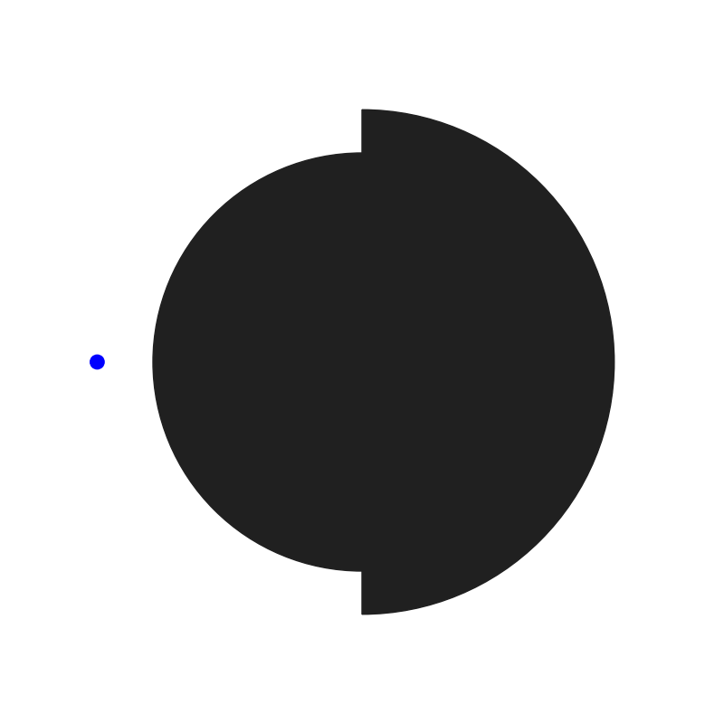
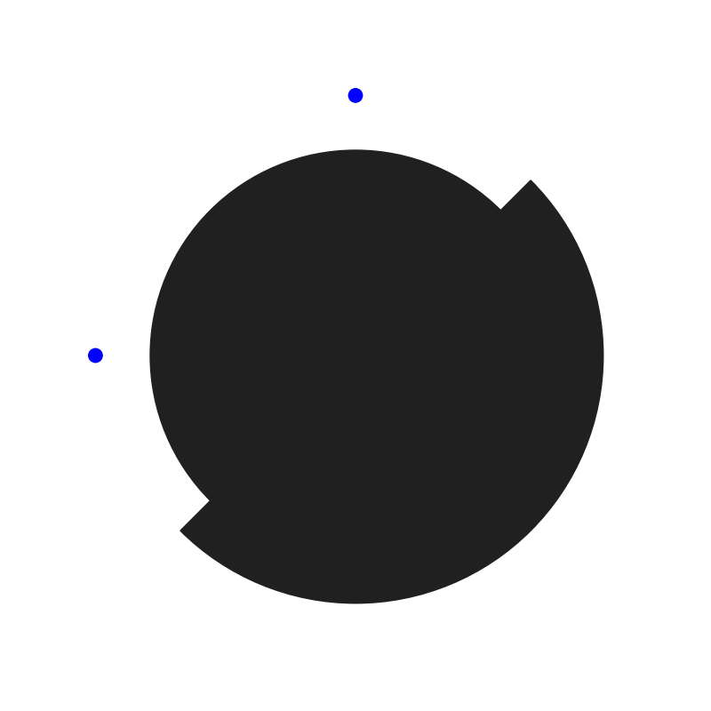
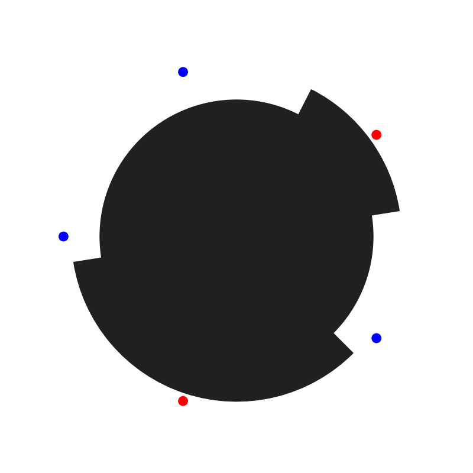

# Example Single Track Gray Codes
| Visualization | Sensor Positions | Track | Position Lookup Table |
| ---- | ---- | ---- | ---- |
|  | 0 | 10 | TODO |
|  | 0, 1 | 1100 | TODO |
|  | 0, 1, 2 | 111000 | TODO |
|  | 0, 1, 2, 3 | 11110000 | TODO |
|  | 0, 1, 2, 3, 4 | 1111100000 | TODO |
|  | 0, 4, 8, 12, 16 | 111111100011100 00000 | TODO |
|  | 0, 1, 2, 3, 4, 5 | 111111000000 | TODO |
|  | 0, 40, 80, 120, 160, 200, 240, 280, 320 | 111111111111111 111111111111111 111111111111111 111111111000000 000000000001111 000000111111100 000000000000000 000000000111110 001111111111111 111111000000000 000000000000000 000000001100001 111111110000000 000000000001111 111111111111100 011110000000000 000001111110000 011111100111001 111000000000001 110011111111000 111110000000111 110000001111111 001111110000000 000000000001100 | TODO |
